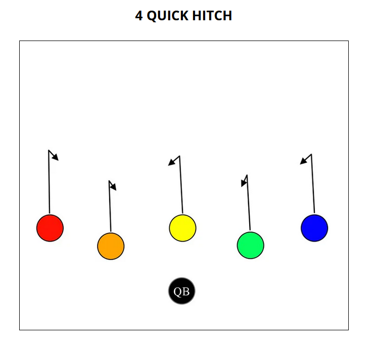
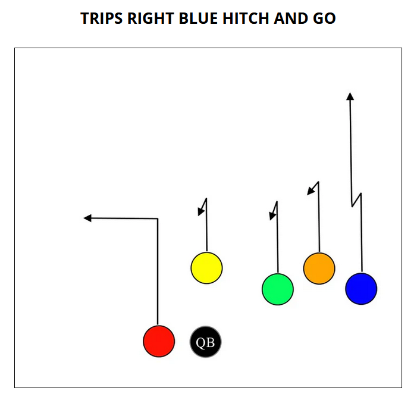
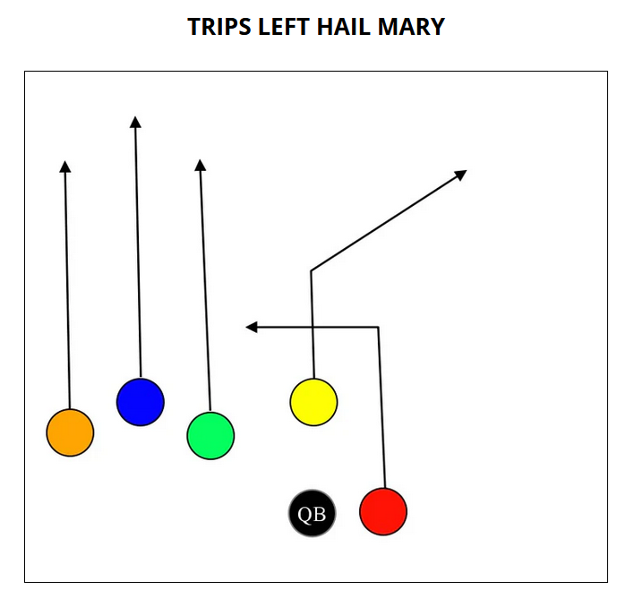

# Seahawks Fall 2025

Captains:
- Arthur
- Ben

## September 19: Jaguars

- Loss 13-18
- We had a chance at the end
- Passing playbook between coach was inefficient
  - Joe only needs playbook to call out players, not to refer the plays
- Lost our game ball at end
- No penalties for:
  - Offsides
  - Illegal formation
  - Delay of game
- Had to burn two timeouts to prevent delay of game penalties

#### Offense

Team 1:

| Player  | Position        |
| ------- | --------------- |
| Ethan   | Center (Yellow) |
| Arthur  | QB              |
| Jason   | RB (Red)        |
| Avi     | WR (Blue)       |
| Aahil   | WR (Green)      |
| Grayson | WR (Orange)     |

Team 2:

| Player  | Position        |
| ------- | --------------- |
| Austin  | Center (Yellow) |
| Ben     | QB              |
| Maddox  | RB (Red)        |
| Jason   | WR (Blue)       |
| Paxton  | WR (Green)      |
| Oliver  | WR (Orange)     |

#### Defense

Team 1:

| Player  | Position         |
| ------- | ---------------- |
| Jason   | FS (Light Blue)  |
| Grayson | SS (Orange)      |
| Austin  | LB (Dark Blue)   |
| Avi     | LB (Red)         |
| Ben     | Lineman (Green)  |
| Aahil   | Lineman (Yellow) |

Team 2:

| Player  | Position         |
| ------- | ---------------- |
| Arthur  | FS (Light Blue)  |
| Maddox  | SS (Orange)      |
| Grayson | LB (Dark Blue)   |
| Oliver  | LB (Red)         |
| Paxton  | Lineman (Green)  |
| Ethan   | Lineman (Yellow) |

## Playbook

### Offense

#### Running

#### Passing

### Defense

