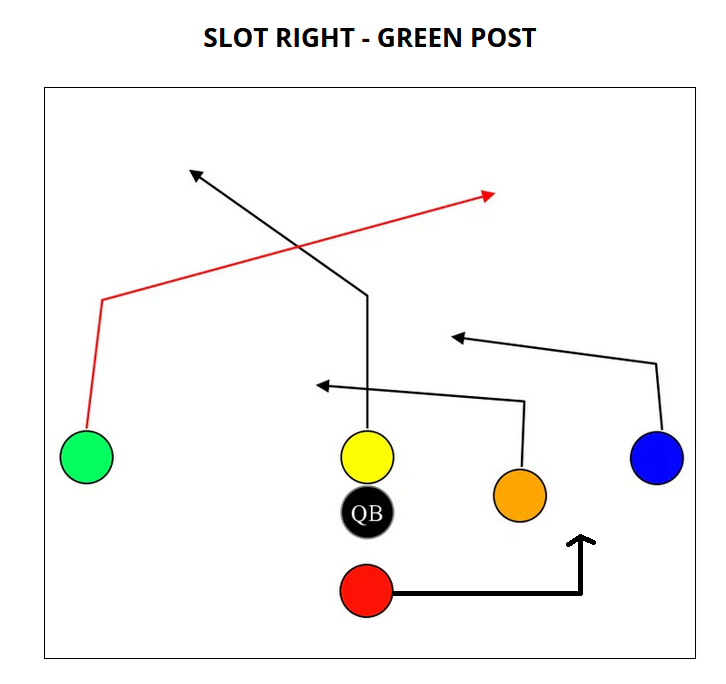
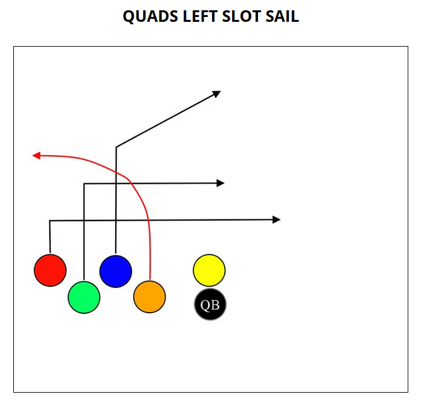
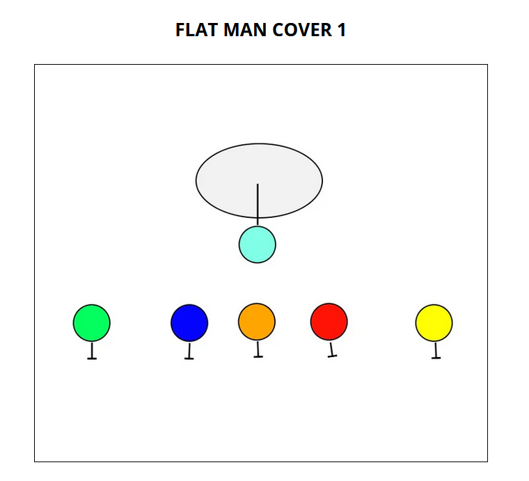

# September 26: Steelers

Captain: Maddox

## Depth Chart

| Player  | Present | Notes |
| ------- | ------- | ----- |
| Aahil   |         |       |
| Arthur  |         |       |
| Austin  |         |       |
| Avi     |         |       |
| Ben     |         |       |
| Ethan   |         |       |
| Grayson |         |       |
| Jason   |         |       |
| Maddox  |         |       |
| Oliver  |         |       |
| Paxton  |         |       |

## Offense

| Position    | Starter | Backup |
| ----------- | ------- | ------ |
| Center      | Austin  | Arthur |
| QB          | Maddox  | Ben    |
| RB (Red)    | Jason   | Aahil  |
| WR (Blue)   | Paxton  | Ethan  |
| WR (Green)  | Grayson | Avi    |
| WR (Orange) | Aahil   | Oliver |

## Defense

| Position | Starter | Backup  |
| ---------| ------- | ------- |
| FS       | Jason   | Arthur  |
| SS       | Grayson | Maddox  |
| LB       | Ethan   | Jason   |
| LB       | Avi     | Aahil   |
| Lineman  | Ben     | Paxton  |
| Lineman  | Oliver  | Austin  |

## Playbook

### Offense

#### Running

#### Passing

### Defense

