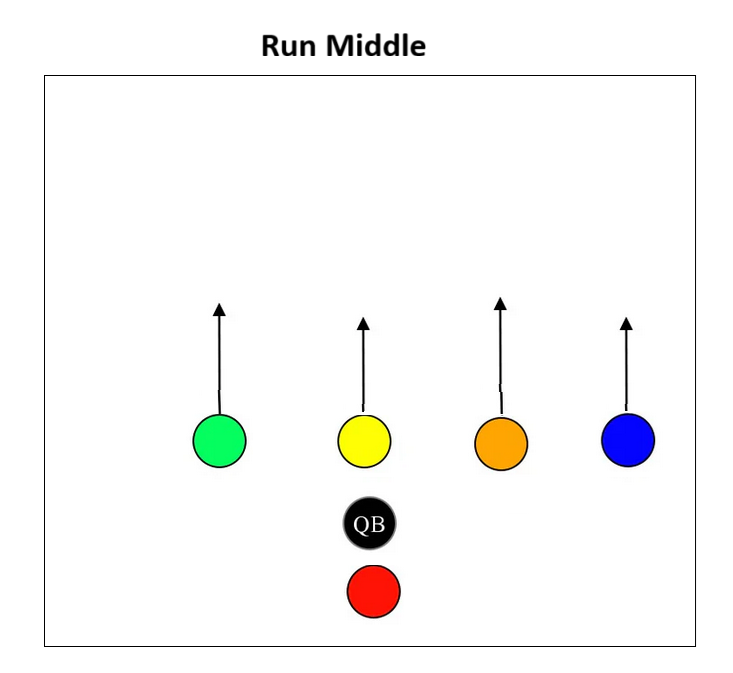
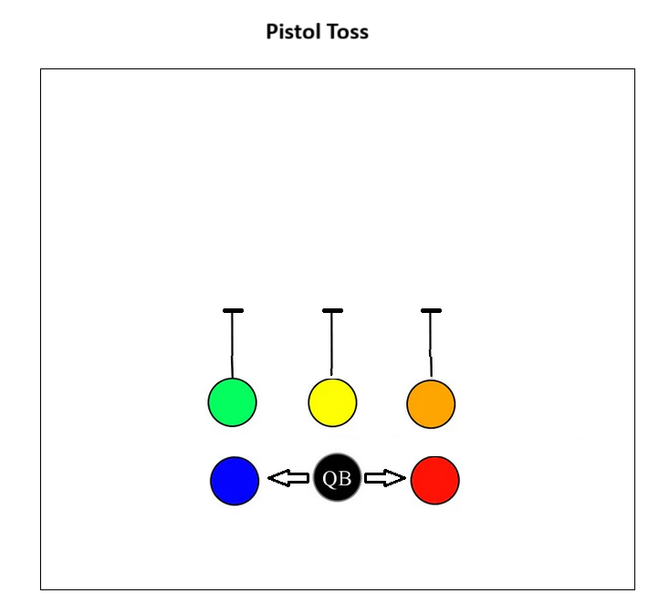
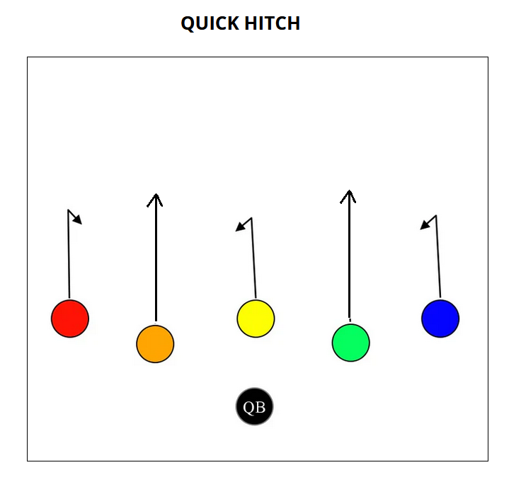
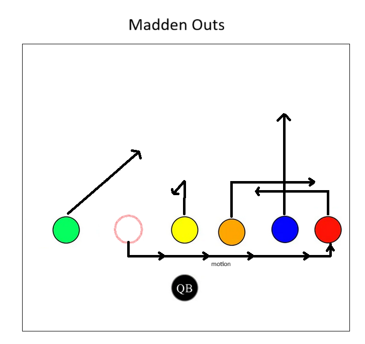
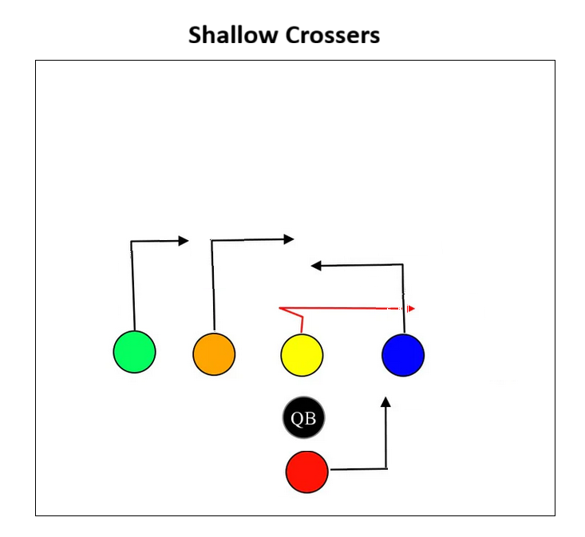
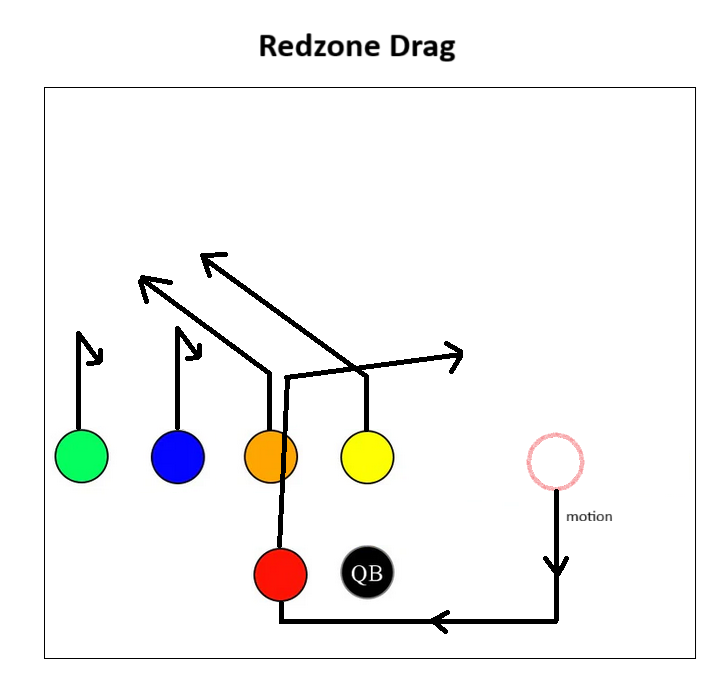
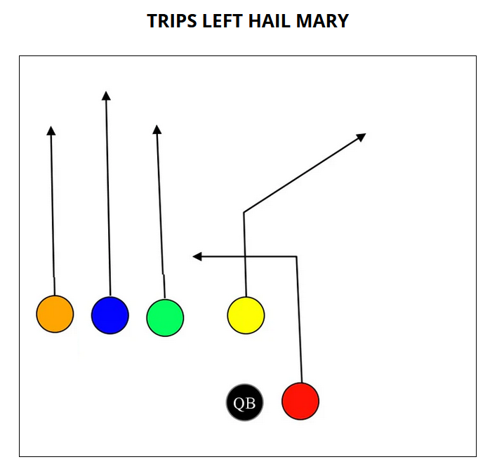
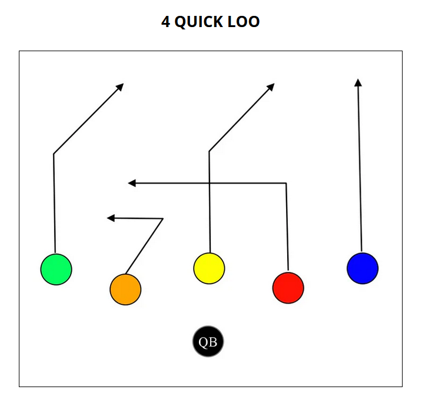

# October 10: Dolphins

- Practice: 5:00pm
- Game: 6:20pm
- Captain: Maddox

## Offense

| Position    | Starter | Sub |
| ----------- | ------- | ------ |
| Center      | Austin  | Ben |
| QB          | Arthur  | Jason |
| RB (Red)    | Grayson | Aahil |
| WR (Blue)   | Maddox  | Paxton |
| WR (Green)  | Ethan   | Aahil  |
| WR (Orange) | Oliver  | Avi |

## Defense

| Position | Starter | Sub     |
| ---------| ------- | ------- |
| FS       | Arthur   | Jason  |
| SS       | Maddox | Grayson  |
| LB       | Ben     | Avi     |
| LB       | Aahil   | Ethan   |
| Lineman  | Austin  | Oliver  |
| Lineman  | Oliver  | Paxton  |

## Playbook

### Running

### Passing

