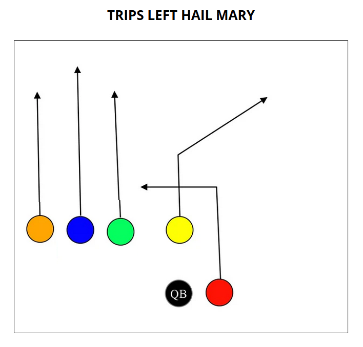

# November 14: Playoffs

- Practice: 4:30pm, Game: 5:30pm
- Captain: TBD

## Offense

| Position    | Starter | Sub   |
| ----------- | ------- | ----- |
| Center      | Austin  | |
| QB          | Jason   | |
| RB (Red)    | Grayson | Aahil |
| WR (Blue)   | Ben     | Avi |
| WR (Green)  | Oliver  | Ethan |
| WR (Orange) | Paxton  | Maddox |

## Defense

| Position | Starter | Sub     |
| ---------| ------- | ------- |
| FS       | Jason   | |
| SS       | Paxton  | Grayson |
| LB       | Avi     | Ben     |
| LB       | Aahil   | Oliver  |
| Lineman  | Maddox  | Ethan   |
| Lineman  | Austin  | |

## Playbook

### Running

### Passing

