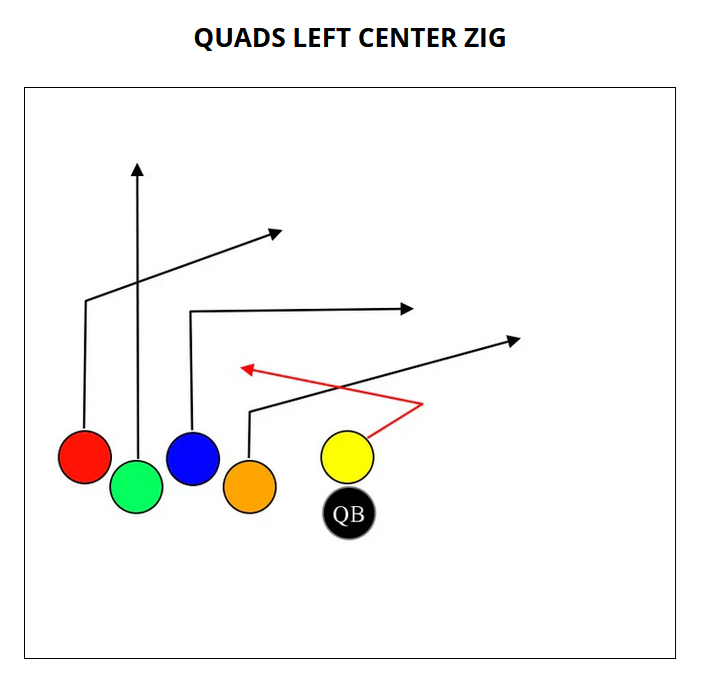
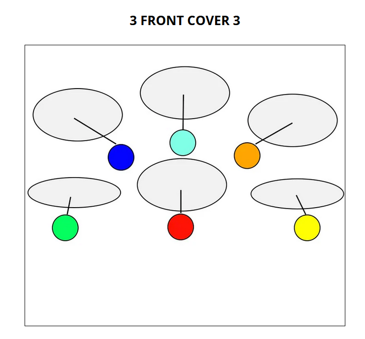
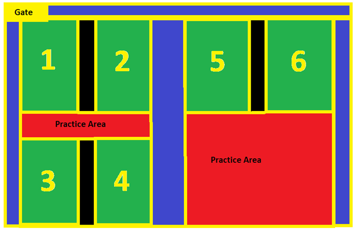

# Seahawks Fall 2025

## Roster

<table>
  <tbody>
    <tr>
      <th>Coaches</th>
      <td>Jonathan, Joe, Richard</td>
    </tr>
    <tr>
      <th>Players (11)</th>
      <td>Aahil, Arthur, Austin, Avi, Ben, Ethan, Grayson, Jason, Maddox, Oliver, Paxton</td>
    </tr>
  </tbody>
</table>

## Schedule

| Date       | Time       | Opponent    |
| ---------- | ---------- | ----------- |
| Sep 19     | 7:10pm     | Jaguars     |
| Sep 26     | 6:20pm     | Steelers    |
| **Oct 3**  | **6:20pm** | **Ravens**  |
| Oct 10     | 6:20pm     | Dolphins    |
| Oct 17     | 6:20pm     | Panthers    |
| Oct 24     | 6:20pm     | Broncos     |
| Nov 7      | 7:10pm     | Patriots    |

## Playbook

### Offense

#### Running

#### Passing

#### Play: Recess

This is a reset/hurry-up play where the players improvise relative to the flow the game.

- QB/coach calls out "Recess"
- Everyone lines up on the line of scrimmage, WRs in either trips or quads
- All receivers improvise

### Defense

### Key

| Position | Color  |
| -------- | ------ |
| Center   | Yellow |
| QB       | Black  |
| RB       | Red    |
| WR       | Blue   |
| WR       | Green  |
| WR       | Orange |

## Gameday agenda

Practice (1 hour):

- Start (~10 minutes):
  - Warm-up
  - Playbook discussion
  - Points of emphasis
- Middle (~20 minutes):
  - Agility drills
    - High knees
    - Butt kicks
    - Backpedal
    - Lateral movement
  - Running routes
    - Curls
    - Slants
    - Go
    - Out
- End (~30 minutes):
  - Coaches split up:
    - Offense: run plays
    - Defense: run coverages
    - Floater
  - 15 minutes: Team 1 offense vs. Team 1 defense
  - 15 minutes: Team 2 offense vs. Team 2 defense
  - Points of emphasis
- Game

Points of emphasis:

- Quick to the line
- Play to the whistle
- 4 Second QB Timer
- Line of scrimmage penalties
- Loud communication
- Don't overpursue the ball
- Hands up, eyes on the ball
- Diamond catch technique
- Flag pulling technique

## Philosophy

- Keep things simple
- Always side-saddle snap
- Coin toss: always defer (other than OT)

## Rules

This content is copied from [here](https://leagues.teamlinkt.com/apexnc/Rules). I've paired this down to just the 2nd-3rd grade rules.

### Game Format

- Field is 25 yards wide and 50 yards long, including the 5-yard end zones.
- Games are 6 v 6 or 5 v 5 formats.
- Two 20-minute running clock halves (5-minute break at half) with two timeouts per halves- 20 seconds each
- Each possession starts at the 5-yard line after scores, turnover on downs and/or halftime
- 30-second play clock
- The offensive team has three downs to get a first down at mid-field, then 4 downs to score once they have crossed mid-field
- All players are eligible
- NO RUSHING THE QUARTERBACK, unless the QB fakes a hand-off, which will trigger a defensive player to cross the LOS and rush the QB.
- Clock stops in the last minute of the game on incompletions and out of bounds
- 3 players must be on the LOS or it will result in illegal formation; the center and one player on both sides need to be on the LOS

### Scoring

- Touchdowns = 6 points
- Extra Point (5-yard line) = 1 point
- Extra Point (10-yard line) = 2 points
- Safety = 2 points; defense gains possession of the ball
  - A safety can happen when the ball carrier’s flag is pulled in the endzone

### Rules

- Two runs per offensive possession
- One run allowed to gain a 1st Down (teams CAN run the ball within 5 yards of midfield)
- One run allowed to advance towards the end zone
- No runs 5yds or less from the end zone
- No runs on extra points
- One coach is allowed on the field for both offense and defense
- Pass count is 4 seconds until "sack"

### Snapping the Ball

- The center can sidesaddle snap.
- If teams choose to do sidesaddle snaps, the center must snap the ball to the QB standing DIRECTLY behind the center; no trick plays can be run from the direct sidesaddle snap

### Mercy Rule

- If a team is up by 30 or more points, they only have 2 downs to get a first down and 2 downs to score until that point difference is trimmed below 30 points, then regular game rules apply
- The team that is behind by 30 or more points will start their offensive possession at the +10-yard line and gets 4 downs to score
- If the point difference is trimmed below 30 pts, then regular game rules apply

### Overall Logistic Rules

- Coin flip determines choice of possession or direction (winning team can elect to defer to the 2nd half)
- The clock will only stop for time-outs and injuries unless it is the last minute of the game; it does not stop for incomplete passes, out of bounds, change of possession
- The clock will stop in the final 1 minute of the game on these actions:
  - Incompletions
  - Out of bounds
  - QB sack and kneel downs
  - Change of possession
  - Penalties - If it's an offensive penalty the clock will start on the official unless dead ball foul
- If a timeout is called after a touchdown, the clock will not start until the play after the conversion attempt
- Teams switch sides at halftime
- If there is a bad snap, the ball is dead and placed at the LOS - there is no loss of yardage
- Center cannot take a handoff from the QB
- Ball is placed where a flag pulled, not where the ball is when the flag is pulled
- A receiver must have one foot in bounds when making a reception
- Laterals are allowed but if the ball hits the ground, the ball is spotted at that yard mark
- Absolutely no tackling or blocking (stationary pick is allowed but player cannot move)
- Only one player can be in motion at the same time
- Games cannot end on a defensive penalty

### Special Alert Rules

- Defensive players can cross the line of scrimmage when a handoff, fake handoff, or backward pass has occurred.
- This "Deception Rule" is applied to define the integrity of the LOS and development of the passing game for both offense and defense; rule applies to all divisions
- Interceptions can be returned for a TD. If intercepting team's flag is pulled before the end zone; possession will begin where the defender is flagged

### Pass Game Rules

- The sack count starts on the snap of the ball no matter what the offensive play is attempted - the word SACK ends the play.
- Forward pass can be underhand or overhand if it is beyond the LOS
- If the QB does not release the ball before time expires, the result of the play is a sack and the ball stays at the LOS
- There are NO forward passes behind the LOS; this will result in a 5-yard penalty and loss of down
- All grade levels have the option to throw a backward pass for a double pass play; this alerts the defense that they can cross the LOS to pull the flag of the player with the ball
- Defense must start 2 yds off the line of scrimmage unless the ball is at the +1 then the defense can start at the goal line

### Run Game Rules

- A play will be considered a run play, when the ball carrier crosses the line of scrimmage, or if a player takes a hand-off from the quarterback and does not cross the line of scrimmage in the allotted time.
- A play in which a player takes a hand-off from the quarterback, and then throws a forward pass will be considered a pass play, and not count as a team's run play.
- If you are going to use a run/pass Option (RPO) play with your RB, this will alert the defense that they can cross the LOS to pull the ball carrier’s flag
- If the QB gives the ball to the RB after a run play has been executed within the offensive possession, the RB can only throw the ball within the sack count

The play is dead when the following occurs to the ball carrier when the flag is pulled when:

- Runner's knee or elbow touches the ground
- Runner steps out of bounds
- Runner loses his flag then the opposing team must touch him down.
- Runner dives/jumps/leaps: ball is spotted where the runner left his feet.

### Game penalties

- The ball carrier can spin to avoid their flag being pulled but cannot flag guard
- No fumbles (a fumbled, or stripped ball is dead and placed at the spot of the fumble with the offensive team retaining possession)

#### Offense penalties

- Offensive Pass Interference
  - 10-yard penalty and replay the down
- Roughing the Passer
  - 10-yard penalty and automatic 1st down
- Illegal motion (2 men in motion)
  - 5-yard penalty and replay the down
- Illegal Formation
  - 5-yard penalty and replay the down
- Illegal Run
  - 5-yard penalty and loss of down
- False Start
  - 5-yard penalty, replay the down
- Illegal Forward Pass
  - 5-yard penalty and loss of down (QB steps over the LOS or QB throws a forward pass behind the LOS with both feet)
- Blocking
  - 5- yard penalty from the spot of the foul and loss of down
- Leaping
  - 5-yard penalty from the spot of the foul and loss of down
- Flag Guarding (including stiff arms)
  - 5-yard penalty from the spot of the foul and loss of down
- Unsportsmanlike conduct
  - 15-yard penalty (possible ejection)
- Delay of Game
  - clock is stopped and a 5-yard penalty

#### Defensive penalties

- Defensive Pass Interference
  - 10-yard penalty and replay down unless it’s an offensive catch; Offense decides. 1st down can occur depending on the yardage.
- Illegal Contact (holding, jams, etc.)
  - 5-yard penalty and replay down unless it’s an offensive catch; Offense decides. 1st can occur depending on the yardage.
- Defensive Holding while pulling flag
  - 5-yard penalty added to the end of the play. 1st down can occur depending on the yardage.
- Illegal Flag Pull (before player has ball)
  - 5-yard penalty and replay down. 1st down can occur depending on the yardage.
- Off-sides
  - 5-yard penalty and replay down. 1st down can occur depending on the yardage Illegal Rushing (before a hand-off has occurred)
- 5-yard penalty and replay the down; offense decides depending on the result of the play. 1st down can occur depending on the yardage.
- Roughing the Passer
  - 10-yard penalty and automatic 1st down
- Inadvertent tackle
  - 5-yard penalty added to the end of the play and replay down Inadvertent tackle From Behind w/clear path to end zone
- automatic touchdown
- Unsportsmanlike conduct
  - 15-yard penalty and automatic 1st down (possible ejection) Defensive Penalties inside the 10-yard line will result in half the distance to the goal line if applicable.

#### Overtime Format (only relevant for playoffs)

- Coin flip determines choice of overtime offensive possession
- Possession begins at the 5-yard line (both teams will go in the same direction)
- Offensive team will get 1 down to score from the 5-yard line
- If a touchdown is scored, the scoring team must go for a 2-point conversion
- An extra point cannot be returned for points; it is a dead ball play
- If the defense intercepts the ball, it’s a change of possession unless the defense returns it for a TD
- Game Over if:
  - intercepting team returns it for a TD on its 1st defensive possession per OT
  - intercepting team was ahead in points in OT prior to playing defense
  - if a team has more points than the other team, after both shared an offensive possession
- If the game is still tied, overtime will be repeated until there is a winner

## Terms

| Term         | Definition                                                                  |
| ------------ | --------------------------------------------------------------------------- |
| Trips        | 3 receivers on one side                                                     |
| Quads        | 4 receivers on one side                                                     |
| Hitch/Quick  | quick 3-5 yard route and turn back to QB                                    |
| Go/Fly       | straight down the field                                                     |
| Sail         | 10-15 yard route and turn back to QB                                        |
| Loo          | 10-15 yard route and turn back to QB, but on the opposite side of the field |
| Hitch and Go | fake a quick route, then go deep                                            |
| Prevent      | all defenders back deep                                                     |
| Cover 3      | 3 defenders back deep, 3 defenders                                          |
| Cover 1      | 1 defender back deep, 5 defenders                                           |
| Slot         | receiver lined up inside, between the wide receiver and the center          |
| 4 Quick      | 4 receivers, 2 on each side of the ball                                     |
| Recess       | reset/hurry-up play where the players improvise relative to the flow the game |

## Games

### September 19: Jaguars

#### Offense

Team 1:

| Player  | Position        |
| ------- | --------------- |
| Ethan   | Center (Yellow) |
| Arthur  | QB              |
| Jason   | RB (Red)        |
| Avi     | WR (Blue)       |
| Aahil   | WR (Green)      |
| Grayson | WR (Orange)     |

Team 2:

| Player  | Position        |
| ------- | --------------- |
| Austin  | Center (Yellow) |
| Ben     | QB              |
| Maddox  | RB (Red)        |
| Jason   | WR (Blue)       |
| Paxton  | WR (Green)      |
| Oliver  | WR (Orange)     |

#### Defense

Team 1:

| Player  | Position         |
| ------- | ---------------- |
| Jason   | FS (Light Blue)  |
| Grayson | SS (Orange)      |
| Austin  | LB (Dark Blue)   |
| Avi     | LB (Red)         |
| Ben     | Lineman (Green)  |
| Aahil   | Lineman (Yellow) |

Team 2:

| Player  | Position         |
| ------- | ---------------- |
| Arthur  | FS (Light Blue)  |
| Maddox  | SS (Orange)      |
| Grayson | LB (Dark Blue)   |
| Oliver  | LB (Red)         |
| Paxton  | Lineman (Green)  |
| Ethan   | Lineman (Yellow) |

## Links

- [Pleasant Park 3400 Pleasant Plns Rd](https://www.google.com/maps/place/Pleasant+Park/@35.702042,-78.8835859,766m/data=!3m2!1e3!4b1!4m6!3m5!1s0x89ac930547618115:0x27bbf8c7665e8f57!8m2!3d35.702042!4d-78.881011!16s%2Fg%2F11p013hzqx?entry=ttu&g_ep=EgoyMDI1MDkxMC4wIKXMDSoASAFQAw%3D%3D)
- [Apex Rise](https://leagues.teamlinkt.com/apexnc)
- [Field Map](https://cdn-app.teamlinkt.com/media/association_data/12456/photo_album/118917/1189171738948205jwXmkhpaUt/TL_photo_1738948205.jpg)
- [Rules](https://leagues.teamlinkt.com/apexnc/Rules)
- [myfootballplays.com](https://myfootballplays.com/blogs/6-on-6-flag-football-plays)

## Field Map

